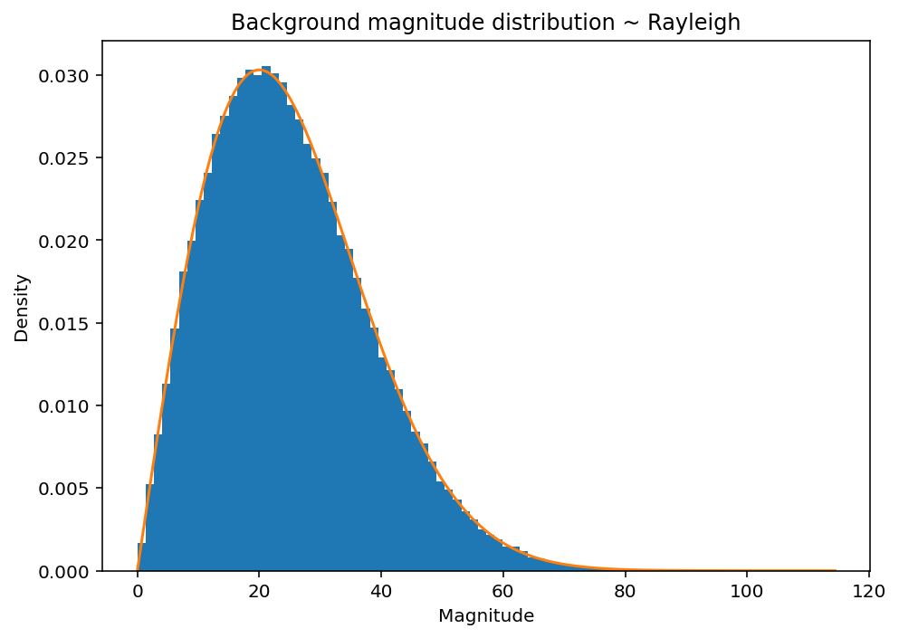

# MRI magnitude noise model

Magnetic resonance images are typically stored and analyzed as magnitude data,
obtained from the quadrature combination of the real and imaginary components
of the complex MR signal. While this representation is convenient, it introduces
a characteristic noise behavior that differs from the original Gaussian noise
present in the complex domain.

In regions where no true signal is present, such as background areas outside
the object, the magnitude values follow a **Rayleigh distribution**. This
property allows the noise level to be estimated directly from background
statistics and is commonly exploited in MRI preprocessing.

When a true signal is present, the magnitude image no longer follows a Rayleigh
distribution. Instead, the combination of the underlying signal amplitude and
additive complex Gaussian noise results in a **Rician distribution** for the
measured magnitude values. This transition from Rayleigh (noise-only) to Rician
(signal plus noise) is a fundamental aspect of MRI magnitude data and has
important implications for quantitative analysis.

In this section, the magnitude noise model is illustrated by simulating the
quadrature sum of a deterministic signal and Gaussian noise, producing
synthetic magnitude data of the form:

M = sqrt{A^2 + N^2}

[Download code here](https://github.com/SereBede/mri-noiselab/tree/main/tutorial/noise_model_explanation.py)

## Import, useful functions and random generator

```{literalinclude} ..\..\..\tutorial\noise_model_explanation.py
:language: python
:linenos:
:lines: 25-77
```

## 1) Background Rayleigh noise distribution generation

```{literalinclude} ..\..\..\tutorial\noise_model_explanation.py
:language: python
:linenos:
:lines: 82-111
```


## 2) Signal Rician distribution generation
```{literalinclude} ..\..\..\tutorial\noise_model_explanation.py
:language: python
:linenos:
:lines: 116-139
```


## 3) Apply cleaning on a small phantom

Here we make a 2D phantom, add Rician noise in-signal, Rayleigh in background,
then run mrnl.subtract_noise(image, bg_area).

```{literalinclude} ..\..\..\tutorial\noise_model_explanation.py
:language: python
:linenos:
:lines: 151-173
```


## References and further reading

- R. Mark Henkelman, *Measurement of signal intensities in the presence of noise
  in MR images*, Medical Physics, 1985.

- [Rayleigh distribution — Wikipedia](https://en.wikipedia.org/wiki/Rayleigh_distribution)

- [Rice distribution — Wikipedia](https://en.wikipedia.org/wiki/Rice_distribution)

- [`scipy.stats.rayleigh`](https://docs.scipy.org/doc/scipy/reference/generated/scipy.stats.rayleigh.html)

- [`scipy.stats.rice`](https://docs.scipy.org/doc/scipy/reference/generated/scipy.stats.rice.html)

- [`scipy.stats.kstest`](https://docs.scipy.org/doc/scipy/reference/generated/scipy.stats.kstest.html)
