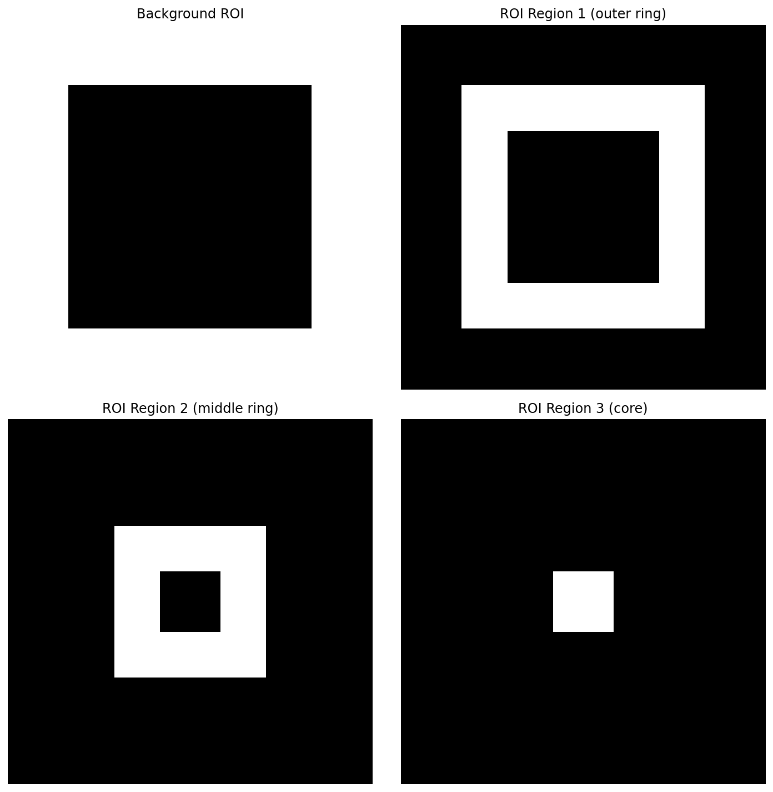
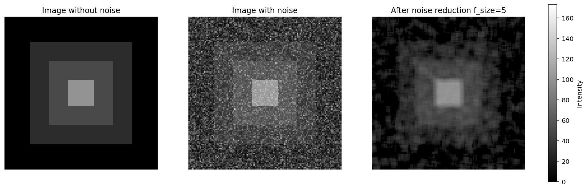

# Region-based processing
 
This example performs noise subtraction **one ROI at a time** using **masked arrays**.
Instead of applying `mri_noiselab.subtract_noise()` on the full image, it uses
`mri_noiselab.subtract_noise_masked()` to correct only the pixels belonging to each region,
then merges the corrected regions back into a final image.

Core steps in the script:
1. Simulate a 3-level phantom and add **Rayleigh** background noise (magnitude model).
2. Define **disjoint** ROI masks (outer ring, middle ring, core) plus a background ROI.
3. Apply `subtract_noise_masked()` region-by-region (noise estimated from background).
4. Merge cleaned regions into a single corrected image.
5. Print statistics before vs after for each region.

[Download code here](https://github.com/SereBede/mri-noiselab/tree/main/tutorial/example_3_ROIs.py)

Requires: numpy, matplotlib, mri-noiselab

## 0) Import modules and define helper function

```{literalinclude} ..\..\..\tutorial\example_3_ROIs.py
:language: python
:linenos:
:lines: 11-28
```

## 1) Simulate Phantom with noise

```{literalinclude} ..\..\..\tutorial\example_3_ROIs.py
:language: python
:linenos:
:lines: 31-52
```

## 2) Define disjoint ROIs and plot them

```{literalinclude} ..\..\..\tutorial\example_3_ROIs.py
:language: python
:linenos:
:lines: 55-89
```


## 3) Clean one ROI at a time

```{literalinclude} ..\..\..\tutorial\example_3_ROIs.py
:language: python
:linenos:
:lines: 91-109
```

## 4) Compute region-wise statistics (before vs after)

```{literalinclude} ..\..\..\tutorial\example_3_ROIs.py
:language: python
:linenos:
:lines: 111-120
```

Inspecting the standard output, it is possible to observe that in the cleaned regions:
- mean magnitude moves closer to the **true** signal level
- the standard deviation is reduced
- the SNR improves except for background, as expected

```
(Example standard output)
Region MEAN | Before | After
Background | 39.99 | 8.13
Region 1   | 51.59 | 28.67
Region 2   | 65.95 | 49.71
Region 3   | 109.11 | 99.60

Region STD | Before | After
Background | 20.88 | 10.27
Region 1   | 16.42 | 7.53
Region 2   | 13.76 | 3.83
Region 3   | 8.05 | 1.28

Region SNR | Before | After
Background | 4.67 | 1.63
Region 1   | 10.87 | 15.49
Region 2   | 23.99 | 169.89
Region 3   | 184.57 | 6011.73
```

## 5) Show compared results

```{literalinclude} ..\..\..\tutorial\example_3_ROIs.py
:language: python
:linenos:
:lines: 123-140
```


By comparing the result obtained above and the one obtained in the previous tutorial without masking (reported also below), it is possible to see edges are preserved. This feature is particulary important in morphological application.

